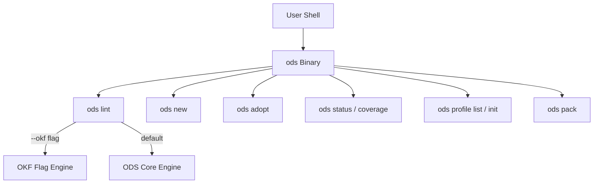

# Master Implementation Plan: CLI Unification (`ods`), Single Skill Consolidation, Custom Profile Spec, & Semantic Architecture

This implementation plan outlines the complete engineering strategy to **restore the `ods` binary as the single unified CLI**, **remove separate subcommand trees (`okf`, `skill`, etc.)**, **consolidate all AI agent skills into a single `skills/ods/SKILL.md`**, **implement the strict Custom Profile Specification**, **rearrange `src/` child folders in a clean semantic manner**, and **update all end-user documentation and guides**.

---

## 1. Objectives & Executive Summary

1. **CLI Binary & Command Unification (`ods`)**:
   - Rename primary CLI binary from `ods` back to **`ods`** (Open Document Spec).
   - Eliminate separate spec subcommands (`ods okf *`, `ods skill *`).
   - All commands become top-level `ods` actions: `ods lint`, `ods init`, `ods adopt`, `ods new`, `ods status`, `ods profile`, `ods coverage`, `ods format`, `ods audit`, `ods pack`.
   - Multi-spec support (e.g. OKF) is handled strictly via flag (`--okf` or `--spec okf`) rather than separate CLI command sub-namespaces.

2. **Custom Profile Specification Integration**:
   - **Strict Single-Source Registration**: Register custom profiles **only** via `custom-profiles:` in root `index.md` (no folder auto-discovery).
   - **Custom Profile Marker**: Profile definitions specify `ods.profile: custom-profile`.
   - **Profile Identifier**: Derived from `name:` field, falling back to filename stem.
   - **Key Validation**: Enforce required frontmatter keys declared in `expected_keys:` (sole canonical key name).
   - **Nested H2 & H3 Section Hierarchy**: Validate both `## H2` parent sections and `### H3` child sections.
   - **Self-Templating Engine & Path Conventions**: `ods new <profile> <path>` scaffolding and folder path inferencing (`/adrs/` $\rightarrow$ `decision`, `/features/` $\rightarrow$ `feature`).

3. **Single Consolidated Agent Skill (`skills/ods/SKILL.md`)**:
   - Remove separate/isolated spec skill directories (such as `skills/okf/`).
   - Maintain a single, authoritative agent skill file at **`skills/ods/SKILL.md`**.

4. **Semantic Codebase & Child Folder Rearrangement under `src/`**:
   - Re-organize `src/` into semantically divided crates and domain subfolders:
     - `src/ods-core`: Engine core (`model/`, `parse/`, `profiles/`, `lint/`, `graph/`, `lifecycle/`, `fs/`, `bench/`, `export/`).
     - `src/ods-cli`: CLI binary & command runners (`cli/`, `commands/`, `service/`, `update/`, `support/`).
     - `src/ods-test-support`: Workspace test harness & test fixtures.

5. **Complete Documentation & End-User Guide Updates**:
   - Audit and update all documentation (`docs/guide/`, `docs/specs/`, `docs/plan/`), user guides, `README.md`, `CONTRIBUTING.md`, GitHub Action `action.yml`, and website catalog docs.

---

## 2. Architecture & CLI Design

### A. Unified CLI Surface (`ods`)



---

### B. Single Skill Architecture (`skills/ods/SKILL.md`)

```
skills/
├── index.md
└── ods/
    ├── SKILL.md             <-- The ONLY skill file for AI Agents
    ├── CHANGELOG.md
    ├── evals/
    ├── references/
    └── scripts/
```

---

## 3. Semantic Codebase & Child Folder Rearrangement under `src/`

```
src/
├── index.md
├── ods-core/                           <-- Engine Core Crate (formerly ods-core)
│   ├── Cargo.toml
│   └── src/
│       ├── lib.rs
│       ├── model/                      <-- Document & Catalog Models
│       ├── parse/                      <-- Markdown & Frontmatter Parsers
│       ├── profiles/                   <-- Profiles, H2/H3 Trees, & Scaffolding Engine
│       ├── lint/                       <-- Linters, Tag Checkers, & Canonical Rules
│       ├── graph/                      <-- Document Graph & Dependency Indexer
│       ├── lifecycle/                  <-- Document Lifecycle, Adopt, & Rename
│       ├── fs/                         <-- File Scanner & Loader
│       ├── bench/                      <-- Scale Benchmarks
│       └── export/                     <-- Workspace Exporters
├── ods-cli/                            <-- CLI Binary Crate (formerly ods)
│   ├── Cargo.toml
│   └── src/
│       ├── main.rs
│       ├── cli/                        <-- Arg Parsing & Dispatch
│       ├── commands/                   <-- Command Modules (Reorganized)
│       │   ├── document/               <-- init, adopt, new, lint, format, status, coverage
│       │   ├── profile/                <-- profile list, profile init
│       │   ├── workspace/              <-- workspaces, pack
│       │   ├── lifecycle/              <-- enable, disable, archive, mv
│       │   └── service/                <-- serve, watch, start, stop
│       ├── service/                    <-- Background Daemon Service
│       ├── update/                     <-- Self-Update & Upgrade Runner
│       └── support/                    <-- Terminal Formatting & Output Helpers
└── ods-test-support/                   <-- Test Helpers Crate (formerly ods-test-support)
    ├── Cargo.toml
    └── src/
        └── lib.rs
```

---

## 4. Sequential Master Task Breakdown

### Phase 1: Skills Consolidation & Cleanup
- [ ] Delete `skills/okf/` folder.
- [ ] Update `skills/ods/SKILL.md` to reference `ods` commands, `--okf` flag, and `custom-profiles:` root registration.

### Phase 2: Semantic Crate Renaming & Child Folder Refactoring
- [ ] Rename crate folders: `ods-core` $\rightarrow$ `ods-core`, `ods` $\rightarrow$ `ods-cli`, `ods-test-support` $\rightarrow$ `ods-test-support`.
- [ ] Update root `Cargo.toml` and crate `Cargo.toml` manifest files.
- [ ] Rearrange `ods-core/src/` child files into semantic subfolders (`model/`, `parse/`, `profiles/`, `lint/`, `graph/`, `lifecycle/`, `fs/`, `bench/`, `export/`).
- [ ] Rearrange `ods-cli/src/` child files into semantic subfolders (`cli/`, `commands/document/`, `commands/profile/`, `commands/workspace/`, `commands/lifecycle/`, `commands/service/`, `support/`).

### Phase 3: Custom Profile Engine & Catalog Implementation (`ods-core`)
- [ ] Implement strict `custom-profiles:` loader in root `index.md` (no folder auto-discovery).
- [ ] Parse `ods.profile: custom-profile` schema definition files.
- [ ] Resolve profile name from `name:` field, falling back to file stem if omitted.
- [ ] Parse `expected_keys:` list (strictly using `expected_keys`) and enforce key presence during `ods lint`.
- [ ] Implement nested `## H2` parent and `### H3` child section tree validation in `ods lint`.
- [ ] Implement `render_profile_template` scaffolding engine.
- [ ] Implement implicit path-based profile convention mapping (`/adrs/` $\rightarrow$ `decision`, `/features/` $\rightarrow$ `feature`).

### Phase 4: Unified CLI Command Runner Implementation (`ods-cli`)
- [ ] Set CLI binary target name to `ods`.
- [ ] Update CLI argument parser in `ods-cli` to handle direct `ods <command>` surface.
- [ ] Remove `okf` and `skill` subcommand handlers from CLI parser; route OKF verification through `--okf` flag.
- [ ] Implement `ods profile list`, `ods profile init`, `ods new`, and `ods status` handlers.

### Phase 5: Crate Test Alignments & Integration Verification
- [ ] Update imports across `ods-core` and `ods-cli`.
- [ ] Update all integration tests in `ods-core/tests/` and `ods-cli/tests/`.

### Phase 6: Complete Documentation & End-User Guides Update
- [ ] Update `README.md` with new `ods` CLI commands, single skill `skills/ods/SKILL.md`, custom profile registration, and scaffolding examples.
- [ ] Update `CONTRIBUTING.md` with `cargo run --bin ods` build and test commands.
- [ ] Update all files in `docs/guide/` to reflect native `ods` commands and `--okf` flag.
- [ ] Update all specification files in `specs/` and `docs/specs/`.
- [ ] Update `action.yml` and CI scripts (`src/action/scripts/test-action.sh`).

---

## 5. Verification & Testing Strategy

### Automated Verification

Run full workspace tests:
```bash
cargo test --workspace
```

Specific test checks:
1. **Binary Target Verification**: Ensure `cargo run --bin ods -- --version` prints `ods <version>`.
2. **Strict Single-Source Registration Test**: Ensure only custom profiles registered under `custom-profiles:` in root `index.md` are loaded.
3. **H2 & H3 Tree Validation Test**: Verify `ods lint` validates parent H2 and child H3 section trees.
4. **Key Validation Test**: Verify `ods lint` enforces keys listed in `expected_keys`.
5. **Core Commands Test**: `ods lint`, `ods new`, `ods adopt`, `ods status`, `ods profile list`, `ods profile init`.
6. **OKF Flag Verification**: Ensure `ods lint --okf` executes OKF validation.

### Manual Workflow Verification

1. Register custom profile in root `index.md`:
   ```yaml
   custom-profiles:
     - .ods/profiles/api_endpoint.md
   ```
2. `cargo run --bin ods -- profile init api_endpoint`
3. `cargo run --bin ods -- profile list`
4. `cargo run --bin ods -- new api_endpoint docs/apis/users-v1.md --title "Users API v1"`
5. `cargo run --bin ods -- lint docs/apis/users-v1.md`
6. `cargo run --bin ods -- status`
