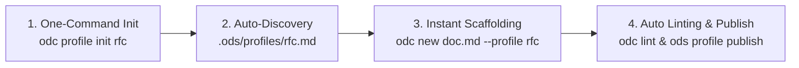

# Unified Multi-Spec Architecture Plan: Friction-Less Custom Profiles, Self-Templating Engine, ODS Packs, and Coverage

## Executive Summary
This document specifies the core architecture for unifying multi-spec handling (ODS + OKF) in `ods`. It details the **Zero-Friction Custom Profile Workflow** in consumer repos, **Self-Templating Custom Profiles**, the **ODS Pack Registry & Dependency Management System**, the **`ods coverage`** command, and the **Spec Key Descriptor** engine.

---

## 1. Friction-Less Custom Profiles in Consumer Repositories

### The Goal: Zero Boilerplate, Zero Configuration
Creating and using custom profiles in a consumer repository must require **zero manual setup, zero JSON schema files, and zero manual registration**.

### The 4 Pillars of Zero-Friction Custom Profiles



#### Pillar 1: One-Command Scaffolding (`ods profile init <name>`)
To create a custom profile in a consumer repo, the developer runs a single CLI command:
```bash
ods profile init rfc
```
This instantly scaffolds `.ods/profiles/rfc.md` pre-populated with clean, documented profile schema structure:

```markdown
---
description: "Request for Comments (RFC) technical decision record"
expected_keys:
  - author
  - reviewer
aliases:
  Context:
    - Background
    - Motivation
  Proposal:
    - Technical Design
---

# RFC: [Title]

## Context | Background
<!-- Explain the problem statement, context, and motivation. -->

## Proposal | Technical Design
<!-- Describe the proposed technical architecture and design choices. -->

## Decision | Outcome
<!-- Record the final decision and next steps. -->
```

#### Pillar 2: Automatic Discovery (Convention over Configuration)
`ods` automatically scans for custom profiles in the `.ods/profiles/` directory (or legacy `ods-profiles/`), global cache `~/.ods/profiles/`, and imported `packs:`.
- **No manifest updates required.**
- **No config files required.**
- Simply drop or edit a `.md` file inside `.ods/profiles/`, and `ods` immediately recognizes it workspace-wide.

#### Pillar 3: Instant Scaffolding (`ods new`)
Authors immediately use the custom profile:
```bash
ods new docs/rfcs/001-caching.md --profile rfc
```
`ods` injects top-level custom frontmatter stubs (`author: ""`, `reviewer: ""`) and populates the document body with the exact starter Markdown prose defined in `.ods/profiles/rfc.md`.

#### Pillar 4: Seamless Sharing & Publishing (`ods profile publish`)
When a custom profile created in one repo proves valuable for the entire organization:
```bash
ods profile publish rfc --to-global       # Promotes profile to ~/.ods/profiles/ (machine-global)
ods profile publish rfc --to-pack <path>   # Adds profile to an ODS Pack for org distribution
```

---

## 2. Self-Templating Custom Profiles (Schema + Template in One File)

Every custom profile file serves as both:
1. **Validation Schema**: Frontmatter defines `expected_keys:`, section `aliases:`, and description.
2. **Scaffolding Template**: Markdown body prose provides standard headers, guidance comments, and boilerplate text.

---

## 3. ODS Pack Registry & Pack Dependency Management

### Pack Precedence Layering
$$\text{Standard Profiles (Built-in)} \rightarrow \text{Global Cached Packs } (\text{\sim/.\!ods/packs/}) \rightarrow \text{Workspace Packs } (\texttt{packs:}) \rightarrow \text{Local } (\texttt{.ods/profiles/})$$

### Pack Registry Workflow
- `ods pack add <src>`: Installs Git URLs (`https://github.com/org/pack.git`), GitHub shorthand (`org/pack`), or local paths (`../pack`).
- `ods pack sync`: Pulls latest Git updates across installed remote packs.
- `ods pack list`: Displays active installed packs, contributed profiles, and skills.
- `ods pack preview <name>`: Inspects profiles and templates inside a pack.

---

## 4. Audit vs. Lint vs. Coverage Command

| Command | Primary Purpose | User-Facing Mental Model | Output / Report |
| :--- | :--- | :--- | :--- |
| **`ods coverage`** | **Documentation Health Score & Percentage** | *"How much of my project documentation is conformant and ready?"* | `85% Compliant` stdout & `ods-report.md` |
| **`ods lint`** | **CI Validation Gate** | *"Does this PR break frontmatter syntax, profile headings, or graph links?"* | Exit 0/1 & `.ods/ods-errors.md` |
| **`ods audit`** | **Detailed Engineering Inventory** | *"What are the exact levels, missing keys, and custom keys across all files?"* | Detailed stdout survey |

---

## 5. Simplified Compliance Status ("Compliant" vs "Non-Compliant")

- **✔ Compliant (Valid ODS/OKF Document)**: File has valid frontmatter (`ods:` map / `okf_version:`), valid `profile`, valid `status`, and clean section/graph links.
- **✖ Non-Compliant (Needs Action)**:
  - *Plain Markdown (Level 0)*: No frontmatter present. Action: Run `ods adopt --write`.
  - *Invalid / Incomplete*: Syntax error in YAML or missing required profile/status fields.
- **Ignored**: Excluded by `.gitignore` or root `index.md` `ignore:` patterns.

---

## 6. Summary of CLI Commands

| Command | Action / Behavior | Report Output |
| :--- | :--- | :--- |
| **`ods profile init <name>`** | Scaffolds a new friction-less custom profile schema & template in `.ods/profiles/` | Created `.md` profile |
| **`ods profile publish <name>`** | Promotes local custom profile to global user cache or an ODS Pack | Promoted profile |
| **`ods coverage`** | High-level coverage score % & Compliant vs Non-Compliant count | Output: stdout / `ods-report.md` |
| **`ods coverage --write-report`** | Writes coverage report & untracked file recommendations | `ods-report.md` |
| **`ods lint`** | Validates structural integrity & graph links across docs (CI gate) | Output: stdout / `.ods/ods-errors.md` |
| **`ods audit`** | Detailed inventory of docs, custom keys, and level breakdowns | Output: stdout |
| **`ods new <path> --profile <p>`** | Scaffolds doc using self-templating profile body & expected keys | Created `.md` file |
| **`ods pack add <src>`** | Adds an ODS Pack (Git URL, shorthand, or local path) | updates root `index.md` `packs:` |
| **`ods pack sync`** | Updates installed remote Git packs | stdout |

---

## 7. Verification & Testing Strategy

1. **Friction-Less Profile Init & Auto-Discovery Tests**:
   - `cargo test --package ods-core test_profile_init_command`
   - `cargo test --package ods-core test_profile_auto_discovery_in_dot_odc`
2. **Self-Templating Profile Tests**:
   - `cargo test --package ods-core test_self_templating_profile_scaffold`
3. **Coverage & Compliance Tests**:
   - `cargo test --package ods-core test_coverage_calculation`
