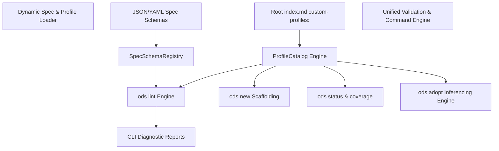

# Master Implementation Plan: Dynamic Spec Engine & End-to-End Custom Profile Management

This document presents the complete architectural design and execution plan to upgrade **Open Document Spec (ODS)** with a **Dynamic, Data-Driven Spec Schema Engine** and an **End-to-End Custom Profile Management System** integrated across all CLI commands (`ods lint`, `ods new`, `ods profile list`, `ods profile init`, `ods status`, `ods adopt`, `ods find`, `ods fmt`).

---

## 1. Core Architectural Goals

### A. Dynamic Data-Driven Spec Engine (`SpecSchemaLoader`)
- **Zero-Code Spec Extensions**: Define new specs (e.g. OKF v0.2, OpenTechSpec, ADRSpec) or add frontmatter keys purely through **JSON/YAML Spec Manifests** (embedded in Rust or loaded from workspace `.ods/schemas/*.json`).
- **Declarative Key Rules**: Every key specifies:
  - `placement`: `TopLevel` (domain attributes like `author`, `reviewer`, `endpoint_url`), `NestedEngineMap` (`ods.profile`, `ods.status`, `ods.id`), or `RootIndexOnly` (`custom-profiles`, `packs`, `ignore`).
  - `key_type`: `String`, `List`, `Map`, `Enum(Vec<String>)`, `Timestamp`.
  - `required`: Boolean flag for schema compliance.
  - `description`: Self-documenting CLI diagnostics and AI context.

### B. Comprehensive Custom Profile Management System
- **Single-Source Registration**: Registered explicitly in root `index.md` under `custom-profiles:` array (or `.ods/profiles/`).
- **Profile Marker**: Custom profile schema files declare `ods.profile: custom-profile`.
- **Dynamic Identification**: Derived from explicit `name:` in profile frontmatter, falling back to file stem (`api_endpoint.md` $\rightarrow$ `api_endpoint`).
- **Dynamic Key Enforcement (`expected_keys`)**: Enforces required keys declared under `expected_keys:` in custom profile frontmatter.
- **Nested H2 & H3 Section Hierarchy**: Validates parent `## H2` and child `### H3` sub-section trees during `ods lint`.

### C. Multi-Tiered Profile Inferencing & Detection Engine
When a document lacks an explicit `ods.profile: <name>` key, ODS resolves the profile through a deterministic 4-tier fallback:
1. **Tier 1: Explicit Frontmatter Profile**: `ods.profile: <name>`.
2. **Tier 2: Directory Path Convention Mapping**:
   - `/adrs/` or `/decisions/` $\rightarrow$ `decision`
   - `/features/` or `/prds/` $\rightarrow$ `feature`
   - `/sops/` or `/runbooks/` $\rightarrow$ `sop`
   - `/apis/` or `/endpoints/` $\rightarrow$ `api`
   - `/rfcs/` $\rightarrow$ `rfc`
   - `/guides/` or `/tutorials/` $\rightarrow$ `guide`
   - `/policies/` $\rightarrow$ `policy`
3. **Tier 3: Heading Signature Fuzzy Matching**: Matches `## H2` and `### H3` headers against standard and registered custom profile section definitions.
4. **Tier 4: Default Fallback**: `note`.

---

## 2. Dynamic Spec & Profile System Architecture



---

## 3. Data Model & Interfaces (`ods-core/src/spec/` & `ods-core/src/profiles/`)

### Dynamic Spec Schema Registry (`ods-core/src/spec/schema.rs`)

```rust
#[derive(Debug, Clone, Serialize, Deserialize)]
pub struct SpecManifest {
    pub name: String,
    pub version: String,
    pub keys: Vec<KeyManifest>,
}

#[derive(Debug, Clone, Serialize, Deserialize)]
pub struct KeyManifest {
    pub name: String,
    pub placement: String, // "top_level" | "nested_ods" | "root_only"
    pub key_type: String,  // "string" | "list" | "map" | "enum"
    pub enum_values: Option<Vec<String>>,
    pub required: bool,
    pub description: String,
}
```

### Custom Profile Definition (`ods-core/src/model.rs`)

```rust
#[derive(Debug, Clone, PartialEq, Eq)]
pub struct ProfileDefinition {
    pub name: String,
    pub description: Option<String>,
    pub sections: Vec<Vec<String>>,        // Parent H2 & Child H3 trees
    pub expected_keys: Vec<String>,       // Frontmatter expected keys
    pub source: PathBuf,
}
```

---

## 4. Sequential Master Task Breakdown

### Phase 1: Dynamic Spec Manifest Loader (`ods-core/src/spec/`)
- [ ] Implement `SpecManifest` JSON/YAML loader in `src/crates/ods-core/src/spec/schema.rs`.
- [ ] Add support for workspace dynamic spec schemas (`.ods/schemas/*.json`).
- [ ] Register standard ODS, OKF v0.2, and dynamic spec manifests.

### Phase 2: Complete Custom Profile Catalog & Inferencing Engine (`ods-core/src/profiles/`)
- [ ] Implement single-source `custom-profiles:` resolver in `profile_catalog_roots`.
- [ ] Parse `name:`, `description:`, `expected_keys:`, and nested H2 (`##`) / H3 (`###`) section trees from custom profile Markdown definitions.
- [ ] Implement 4-tiered profile inferencing engine `resolve_document_profile(doc, catalog)`.
- [ ] Implement template renderer `render_profile_template(catalog, profile_name, title)`.

### Phase 3: Comprehensive CLI Command Integration (`ods-cli`)
- [ ] **`ods lint`**: Integrate schema key placement validation, required `expected_keys` validation, and H2/H3 section tree validation.
- [ ] **`ods new <profile> <path>`**: Implement document scaffolding using custom profile template.
- [ ] **`ods profile list`**: Print detailed catalog of standard (12) and registered custom profiles with H2/H3 section trees and expected keys.
- [ ] **`ods profile init <name>`**: Scaffold a new custom profile schema file at `.ods/profiles/<name>.md`.
- [ ] **`ods status` / `ods coverage`**: Calculate workspace Profile Coverage Health score (% profiled vs notes).
- [ ] **`ods adopt`**: Integrate 4-tiered profile inferencing engine during workspace adoption.
- [ ] **`ods find` / `ods tag` / `ods fmt` / `ods context`**: Add profile-aware flags and filters.

### Phase 4: Test Suite Alignment & Integration Verification
- [ ] Add unit tests in `ods-core` for dynamic spec manifests, custom profile loading, and 4-tier profile inferencing.
- [ ] Add integration tests in `ods-cli/tests/` for `ods profile list`, `ods profile init`, `ods new`, `ods status`, and `ods lint`.
- [ ] Run `cargo test --workspace` to ensure 100% test suite pass.

### Phase 5: End-to-End Documentation & User Guides Update
- [ ] Update `README.md` with dynamic spec schemas, custom profile registration, and scaffolding examples.
- [ ] Update `CONTRIBUTING.md` with schema manifest guidelines.
- [ ] Update `skills/ods/SKILL.md` with custom profile specification and CLI command matrix.
- [ ] Update `specs/profiles.md` and `docs/specs/custom_profiles.md`.

---

## 6. Verification & Testing Strategy

### Automated Verification Command
```bash
cargo test --workspace
```

### End-to-End CLI Verification Scenario

1. Initialize workspace:
   ```bash
   ods init .
   ```
2. Scaffold a custom profile:
   ```bash
   ods profile init api_endpoint
   ```
3. Register custom profile in root `index.md`:
   ```yaml
   custom-profiles:
     - .ods/profiles/api_endpoint.md
   ```
4. List profiles:
   ```bash
   ods profile list
   ```
5. Scaffold a target document:
   ```bash
   ods new api_endpoint docs/apis/users.md --title "Users API"
   ```
6. Run linter & check status:
   ```bash
   ods lint docs/apis/users.md
   ods status
   ```
