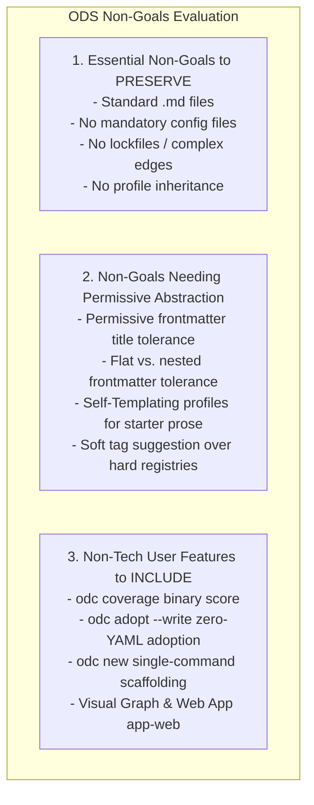

# Non-Technical Users Analysis Report: Re-Evaluating ODS Non-Goals & Abstractions

## Executive Summary
This report analyzes **`specs/non-goals.md`** through the lens of **non-technical users** (Product Managers, Content Writers, Operations, HR, Legal, and Business teams). It determines which non-goals MUST be preserved to prevent technical complexity, which non-goals require permissive CLI/tooling abstractions, and what additions make ODS 100% accessible to non-developers.

---

## 1. Non-Goals Matrix for Non-Technical Users

---

## 2. Detailed Breakdown of ODS Non-Goals

### Category A: Essential Non-Goals (MUST PRESERVE for Non-Tech Users)

These non-goals MUST remain non-goals because removing them would introduce developer friction or technical complexity that overwhelms non-technical authors:

| Non-Goal in `specs/non-goals.md` | Why it MUST Stay a Non-Goal for Non-Tech Users |
| :--- | :--- |
| **No new file extension (`.md`)** | Non-tech users use Notion, Obsidian, Typora, MarkText, and Google Docs export. Proprietary `.ods` extensions break standard Markdown editors. |
| **No manifest or config files** | Non-tech authors should NEVER be required to maintain `workspace.json` or `config.yaml` files. Directories ARE the organization structure. |
| **No lock files or derived stats** | Lockfile merge conflicts in Git confuse non-tech users. Layout and stats MUST be dynamically resolved. |
| **No per-document spec version** | Forcing authors to update `ods_version: 0.1` in every single file creates commit churn and unnecessary editing friction. |
| **No complex edge vocabulary (`implements`, `extends`)** | Programmers understand 10 edge types. Non-tech users need simple, intuitive relationships: `depends` (prerequisite) and `related` (reference). |
| **No profile inheritance trees** | Inheritance hierarchies (`Class A extends Class B`) are a programming construct. Non-tech users need flat, self-contained profiles (`feature`, `guide`, `sop`, `policy`). |

---

### Category B: Non-Goals Needing Permissive Tooling Abstractions

These items in `specs/non-goals.md` were written with a strict developer lens. For non-technical users, `odc` should provide permissive abstractions rather than throwing strict errors:

#### 1. "No frontmatter `title` field" $\longrightarrow$ Permissive Title Handling
- **Developer Spec Rule**: Title MUST exist only once as the first `# H1` in the Markdown body.
- **Non-Tech Reality**: Notion, Obsidian, Docusaurus, and Hugo auto-generate `title: "My Page"` in YAML frontmatter.
- **Non-Tech Abstraction**: `odc` parser MUST NOT hard-fail non-tech documents containing top-level `title:`. When `odc fmt --write` runs, it gracefully converts `title:` into the body `# H1` automatically!

#### 2. "No un-prefixed flat engine keys" $\longrightarrow$ Flat & Nested Frontmatter Tolerance
- **Developer Spec Rule**: ODS engine keys are canonicalized inside a nested `ods:` map (`ods: { profile, status, id }`).
- **Non-Tech Abstraction**: Non-tech authors naturally write flat top-level frontmatter (`profile: guide`, `status: stable`). The `odc` parser accepts flat Level-1 frontmatter natively without requiring users to hand-nest YAML.

#### 3. "No standardized templates / rendering engine" $\longrightarrow$ Self-Templating Profiles
- **Developer Spec Rule**: Standardizing template engines is out of scope.
- **Non-Tech Reality**: Non-tech users face blank-page anxiety and NEED starter boilerplate when creating a document.
- **Non-Tech Solution**: **Self-Templating Profiles** (`odc new docs/guide.md --profile guide`). The profile Markdown file itself provides standard headers and HTML guidance comments without requiring a complex template engine.

#### 4. "No updated timestamp" $\longrightarrow$ Optional `last_updated:` / Git Commit Auto-Display
- **Developer Spec Rule**: Git commit logs are the single source of truth for timestamps.
- **Non-Tech Reality**: Non-tech readers viewing docs on static sites expect a visible "Last updated: 2026-07-30".
- **Non-Tech Solution**: Allow optional `last_updated:` in frontmatter or auto-inject it during `odc export` / `app-web` rendering from git commit history.

---

### Category C: Essential Features ODS Must Provide for Non-Technical Users

To ensure ODS is 100% accessible to Product, Content, Marketing, HR, and Ops teams:

1. **Simplified Compliance Language (`Compliant` vs `Non-Compliant`)**:
   - Replace technical Level 0–3 terminology with human-readable status in `odc coverage` (`85% Compliant`).
2. **Zero-YAML Document Adoption (`odc adopt --write`)**:
   - Non-tech users shouldn't have to hand-code YAML. `odc adopt` scans headings (`Overview`, `Steps`, `Prerequisites`) and automatically drafts Level-1 frontmatter.
3. **One-Command Custom Profile Scaffolding (`odc profile init <name>`)**:
   - `odc profile init rfc` creates `.odc/profiles/rfc.md` pre-filled with clean schema structure.
4. **Visual Web / Desktop UI (`app-web`)**:
   - Non-tech users need a visual graph explorer, tag browser, and Markdown editor to read, edit, and navigate ODS documents visually without terminal commands.
5. **Pure Knowledge Mode (No Source Code Required)**:
   - For non-tech workspaces (company policies, SOPs, marketing guides), the `code:` array is completely optional. ODS works 100% out of the box with standard Markdown prose, resources, and profile validation.

---

## 3. Summary Recommendation Matrix

| Feature / Exclusion | Developer View | Non-Tech User View | Recommended ODS Tooling Abstraction |
| :--- | :--- | :--- | :--- |
| **`.md` File Extension** | Strict `.md` | Standard `.md` | Keep standard `.md` (Zero friction across all editors) |
| **Frontmatter `title:` Key** | Reject in lint | Auto-generated by Notion | Permissive warning / Auto-fix during `odc fmt` |
| **Nested `ods:` Map** | Required canonical format | Writes flat YAML | Accept flat Level-1 natively; migrate on `fmt` |
| **Document Adoption** | Manual frontmatter | Blanket adoption | `odc adopt --write` auto-infers from H2 headings |
| **Profile Templates** | Schema validation | Blank-page helper | Self-Templating Profiles (`odc new --profile 
`) |
| **Compliance Score** | Level 0, 1, 2, 3 | Binary % score | `odc coverage` (`85.0% Compliant`) |
| **Workspace Navigation** | Terminal CLI commands | Visual interface | Web App / Desktop UI (`app-web`) |
